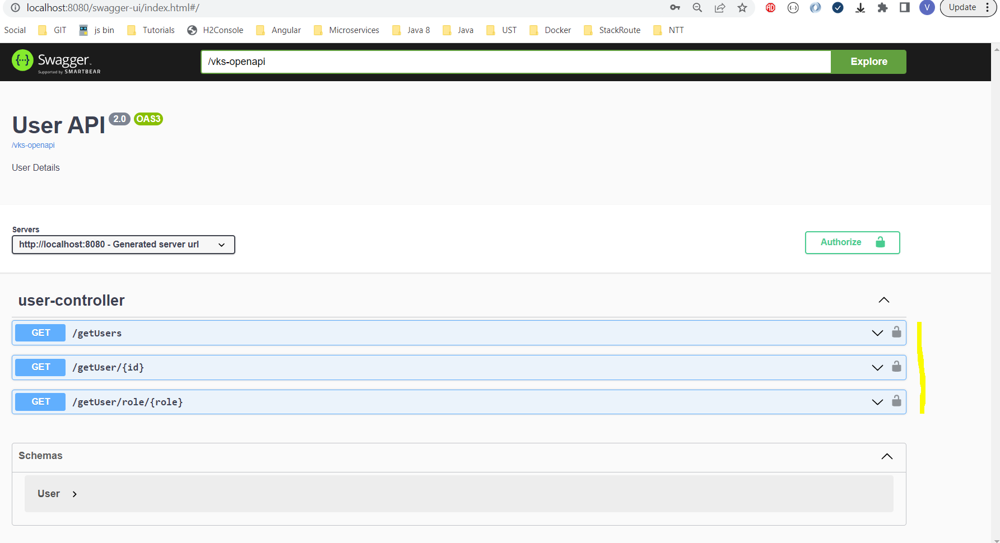

### VKS

# Spring Boot Swagger 3 Security Example

## Run Spring Boot application
```
mvn spring-boot:run
```
## Test Spring Boot Swagger 3 Security Example
<ol>
<li>Open http://localhost:8080/swagger-ui.html in browser to view the Swagger UI documentation. </li>
<li>You can notice the "open lock icon", because we have not done Authorization yet.</li>
<li>Click on <b>Authorize</b> button and provide username (vks) and password (vks).</li>
<li>Once Authorization is done, we can see the "close lock icon".</li>
<li>And now we can access any rest end point to get the response.</li>
</ol>

### URLS
http://localhost:8080/swagger-ui.html

### Snapshots




